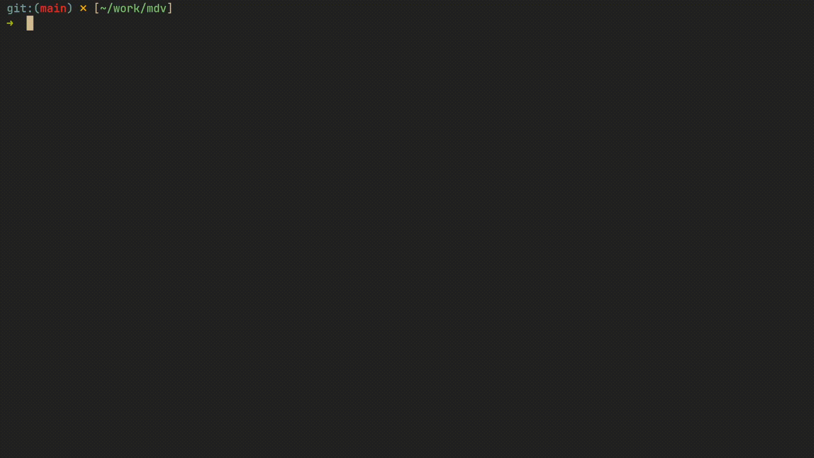

# mdv

A CLI tool that renders Markdown files in the browser with GitHub-style formatting and live reload on file changes.

## Demo



## Features

- GitHub Flavored Markdown (GFM) — tables, strikethrough, autolinks, task lists
- Server-side syntax highlighting via [Chroma](https://github.com/alecthomas/chroma) — no client-side JS
- Mermaid diagrams from fenced `mermaid` blocks, rendered in-browser on demand
- Live reload via SSE — browser updates without full page reload, scroll position preserved
- PDF export — `--pdf output.pdf` flag (headless Chrome) or "Export PDF" button in the browser
- Serves relative local assets from the Markdown directory (e.g. ``)
- Auto-increments port if the default is taken (up to 20 attempts)
- Binds to `127.0.0.1` only — no LAN exposure

## Install

```bash
go install github.com/Allra-Fintech/mdv@latest
```

Or build from source:

```bash
git clone https://github.com/Allra-Fintech/mdv
cd mdv
make install        # installs to ~/.local/bin (default) as mdv
# PREFIX=/usr/local make install   # custom prefix
```

### Make targets

| Target | Description |
|--------|-------------|
| `make build` | Build `./mdv` binary in the project directory |
| `make install` | Build and install to `$PREFIX/bin` (default: `~/.local/bin`) |
| `make uninstall` | Remove installed binary |
| `make clean` | Remove local `./mdv` binary |
| `make test-unit` | Run unit tests |
| `make test-integration` | Run integration tests (live reload, routing, PDF) |
| `make test` | Run all tests |
| `make format` | Format code with `go fmt` |
| `make lint` | Lint with `go vet` |

## Usage

```
mdv [flags] <file.md>
```

### Flags

| Flag | Type | Default | Description |
|------|------|---------|-------------|
| `--port` | int | `7777` | HTTP port (auto-increments if taken) |
| `--no-browser` | bool | `false` | Don't open browser automatically |
| `--theme` | string | `"github"` | Chroma highlight theme |
| `--pdf` | string | `""` | Export to PDF file and exit (requires Chrome or Chromium) |
| `--version` | bool | `false` | Print version and exit |

### Examples

```bash
# Open README.md in browser with live reload
mdv README.md

# Use a custom port and dark highlight theme
mdv --port 8080 --theme monokai README.md

# Print URL but don't open browser
mdv --no-browser README.md

# Export to PDF (requires Chrome or Chromium)
mdv --pdf output.pdf README.md

# Render Mermaid diagrams in fenced mermaid blocks
mdv diagrams.md
```

Example Mermaid block:

    ```mermaid
    flowchart TD
      Start --> Ship
    ```

## HTTP Routes

| Route | Description |
|-------|-------------|
| `GET /` | Redirects to `/<filename>.md` |
| `GET /<file>.md` | Full HTML page (template + rendered markdown) |
| `GET /content?path=/<file>.md` | HTML fragment only (for SSE partial refresh) |
| `GET /events` | SSE stream for live reload |
| `GET /<asset>` | Static files from the Markdown file directory |

## Architecture

```
cmd/mdv/main.go            — CLI flag parsing, resolvePort, openBrowser, wiring
internal/mdv/server.go     — HTTP routes: GET /, GET /content, GET /events (SSE)
internal/mdv/renderer.go   — goldmark setup with GFM, Chroma highlighting, Mermaid block handling
internal/mdv/hub.go        — SSE broadcast hub (Register/Unregister/Broadcast)
internal/mdv/watcher.go    — fsnotify file watcher → hub.Broadcast()
internal/mdv/template.go   — Full HTML page template (inline CSS + SSE JS, Mermaid loader)
internal/mdv/pdf.go        — Headless Chrome PDF export (findChrome, PrintToPDF, WaitForServer)
```

Data flow:

```
fsnotify event → WatchFile() → hub.Broadcast()
                                    ↓
                         SSE clients (/events) receive "reload"
                                    ↓
                    Browser fetches /content → swaps #content innerHTML
```

## Chroma Themes

Common themes: `github`, `github-dark`, `monokai`, `dracula`, `solarized-dark`, `vs`, `xcode`.

Full list: https://xyproto.github.io/splash/docs/

## Why not grip or glow?

| | mdv | grip | glow |
|---|---|---|---|
| Rendering | Local (goldmark) | GitHub API | Local |
| Live reload | Yes — partial, scroll-preserving | No | No |
| Syntax highlighting | Server-side (Chroma) | GitHub API | Terminal colors |
| Mermaid diagrams | Yes | Depends on GitHub | No |
| PDF export | Yes (headless Chrome) | No | No |
| Output | Browser | Browser | Terminal |
| Offline | Yes | No (needs API) | Yes |
| Rate limits | None | GitHub API limits | None |

**grip** sends your Markdown to the GitHub API for rendering — requires a token for heavy use and doesn't work offline. **glow** renders in the terminal, which is great for quick reads but loses fidelity for complex tables, images, and diagrams. **mdv** renders locally in your browser with GitHub-style CSS, live reload as you edit, and zero external API calls.
